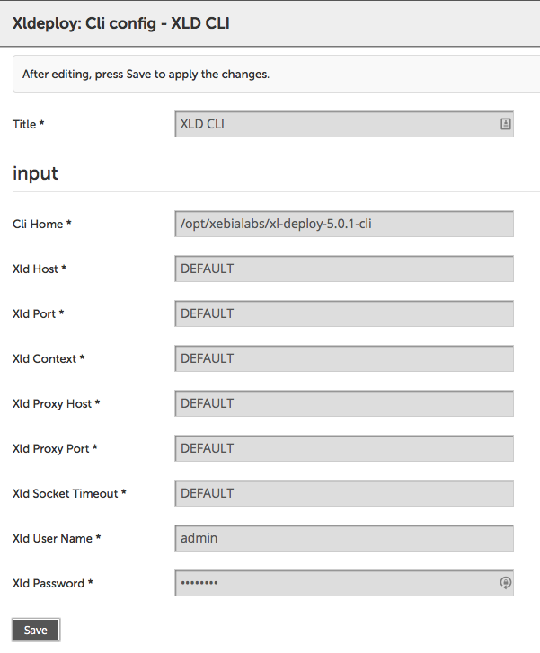
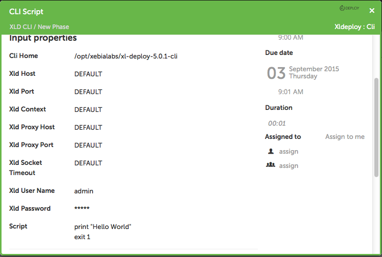
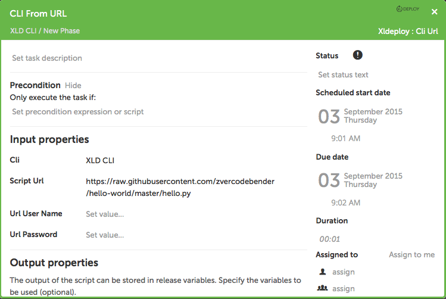
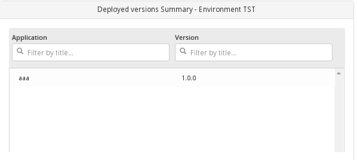

# Preface #

This document describes the functionality provided by the xlr-xldeploy-plugin.

See the **[XL Release Documentation](https://docs.xebialabs.com/xl-release/index.html)** for background information on XL Release and release concepts.

# CI status #

[![Build Status][xlr-xldeploy-plugin-travis-image] ][xlr-xldeploy-plugin-travis-url]
[![Codacy][xlr-xldeploy-plugin-codacy-image] ][xlr-xldeploy-plugin-codacy-url]
[![Code Climate][xlr-xldeploy-plugin-code-climate-image] ][xlr-xldeploy-plugin-code-climate-url]
[![License: MIT][xlr-xldeploy-plugin-license-image] ][xlr-xldeploy-plugin-license-url]
[![Github All Releases][xlr-xldeploy-plugin-downloads-image] ]()


[xlr-xldeploy-plugin-travis-image]: https://travis-ci.org/xebialabs-community/xlr-xldeploy-plugin.svg?branch=master
[xlr-xldeploy-plugin-travis-url]: https://travis-ci.org/xebialabs-community/xlr-xldeploy-plugin
[xlr-xldeploy-plugin-codacy-image]: https://api.codacy.com/project/badge/Grade/b78313b1eb1b4b058dc4512b4d48c26f
[xlr-xldeploy-plugin-codacy-url]: https://www.codacy.com/app/rvanstone/xlr-xldeploy-plugin
[xlr-xldeploy-plugin-code-climate-image]: https://codeclimate.com/github/xebialabs-community/xlr-xldeploy-plugin/badges/gpa.svg
[xlr-xldeploy-plugin-code-climate-url]: https://codeclimate.com/github/xebialabs-community/xlr-xldeploy-plugin
[xlr-xldeploy-plugin-license-image]: https://img.shields.io/badge/License-MIT-yellow.svg
[xlr-xldeploy-plugin-license-url]: https://opensource.org/licenses/MIT
[xlr-xldeploy-plugin-downloads-image]: https://img.shields.io/github/downloads/xebialabs-community/xlr-xldeploy-plugin/total.svg


# Overview #

The xlr-xldeploy-plugin is a XL Release plugin that allows to start a control task, start a deployment, migrate a deployment package to another server or get the latest version of an application on XL Deploy.

## Installation ##

Place the latest released version under the `plugins` dir. If needed append the following to the `script.policy` under `conf`:

```
permission java.io.FilePermission "plugins/*", "read";
permission java.io.FilePermission "conf/logback.xml", "read";
```

+ This plugin (2.3.x+) requires XLR 5.x+
+ When using XL Release 7.x:
    + `v2.9.1` is compatible with XLR 7.x. Use this version if you don't want to go experimental.
    + `v3.x` will only work with XLR 7.x+ and has breaking changes. This means shared configurations and tasks will need to be reconfigured. When an upgrader has been written this will also be mentioned here.
    + If you're using a `v7.x` of the plugin, these are deprecated and should be replaced with a `v3.x` version.

## Types ##

+ ControlTask (compatible with XL Deploy 4.5.2 and up)
  * `ciId`
  * `controlTaskName`
  * `parameters`
  * `continueIfStepFails` (Will try to continue if a step in a control task fails)
  * `numberOfContinueRetrials` (Number of times to retry a step)
  * `pollingInterval`
  * `numberOfPollingTrials`

+ DeployTask (compatible with XL Deploy 4.5.1 and up)
  * `deploymentPackage` (ID of the deployment package to deploy e.g.: `Applications/XL Release/XLR/1.0`)
  * `environment` (ID of the environment to deploy to e.g.: `Environments/Xl Release/XL Release`)
  * `orchestrators` (Comma separated list of orchestrators to be used: `parallel-by-deployment-group, parallel-by-container`)
  * `deployedApplicationProperties` (Dictionary containing all the deployed application properties to be set (except orchestrators). e.g.: `{"maxContainersInParallel": "2"}`)
  * `overrideDeployedProps` (Map contain xpath expression to override deployed properties.) e.g.: {'deployeds/openshift.ResourceModule[@id="Infrastructure/Server/Openshift/project/myapp"]/placeholders/entry[@key="openshift.placeholder"]', 'value'}
  * `deployedProperties` DEPRECATED - (use overrideDeployedProps)(Dictionary containing all the properties to be set. Remark: Each key is an xlrTag in the deployeds - See also [https://github.com/xebialabs-community/xld-xlrelease-plugin](https://github.com/xebialabs-community/xld-xlrelease-plugin), e.g.: `{"Gate1": "{'taskId':'1234567890'}"}`)
  * `continueIfStepFails` (Will try to continue if a step in the deployment task fails)
  * `numberOfContinueRetrials` (Number of times to retry a step)
  * `rollbackOnError` (Whether rollback should be done if the deployment fails)
  * `pollingInterval` (Number of seconds to wait before polling the task status)
  * `numberOfPollingTrials` (Number of times to poll for task status)
  * `failOnPause` (If checked task will fail if the deployment enters a STOPPED state, for example if the xld-pause-plugin is in use. Set to True by default for backwards compatibility)

+ UndeployTask (compatible with XL Deploy 4.5.1 and up)
  * `deployedApplication` - Name of the deployed application you want to undeploy (Only the name, without Environments, etc...)
  * `environment` (ID of the environment to deploy to e.g.: `Environments/Xl Release/XL Release`)
  * `orchestrators` (Comma separated list of orchestrators to be used: `parallel-by-deployment-group, parallel-by-container`)
  * `deployedApplicationProperties` (Dictionary containing all the deployed application properties to be set (except orchestrators). e.g.: `{"maxContainersInParallel": "2"}`)
  * `continueIfStepFails` (Will try to continue if a step in the deployment task fails)
  * `numberOfContinueRetrials` (Number of times to retry a step)
  * `rollbackOnError` (Whether rollback should be done if the deployment fails)
  * `pollingInterval` (Number of seconds to wait before polling the task status)
  * `numberOfPollingTrials` (Number of times to poll for task status)
  * `failOnPause` (If checked task will fail if the deployment enters a STOPPED state, for example if the xld-pause-plugin is in use. Set to True by default for backwards compatibility)

+ Migrate Package (compatible with XL Deploy 6.0.0 and up)
  * `server` - Server to pull a package from
  * `username` - Override source username
  * `password` - Override source password
  * `destinationServer` - Server to pull package to
  * `destinationUsername` - Override destination username
  * `destinationPassword` - Override destination password
  * `deploymentPackage` - ID of the package to migrate (starting with `Applications/`)
  * `autoCreatePath` - If set the task will automatically create the path and application if it doesn't exist in the destination
  * `idempotent` - If True and `deploymentPackage` exists on `destinationServer`, it will be overwritten. If false, it will error.

+ Import Package
  * `server` - Server to import a package to
  * `username` - Override username
  * `password` - Override password
  * `repositoryUrl` - Url of the package
  * `repositoryUsername` - Optional username for the repository
  * `repositoryPassword` - Optional password for the repository

+ Get CI
  * `server` - Server to query
  * `username` - Override username
  * `password` - Override password
  * `ciID` - ID of the Configuration Item wanted
  * `accept` - Desired format of the return: XML or JSON
  * `throwOnFail` - Boolean - If True, a False return will Fail the task rather than just returning False.
  * `response` - Return value of the CI described in the format requested

+ Get All Versions
  * `server` - Server to query
  * `username` - Override username
  * `password` - Override password
  * `applicationId` - ID of the application to query for all package versions
  * `packageId` - Return value with the all package IDs of the application (**NOTE:** this needs to be a variable of the *list* type, and needs to be defined beforehand)

+ Get Latest Version
  * `server` - Server to query
  * `username` - Override username
  * `password` - Override password
  * `applicationId` - ID of the application to query for latest package version
  * `stripApplications` - Whether to strip "Applications/" from the beginning of the returned package ID
  * `packageId` - Return value with the latest package ID

+ Get Last Version Deployed
  * `server` - Server to query
  * `username` - Override username
  * `password` - Override password
  * `environmentId` - ID of the environment to check the application version on
  * `applicationName` - Name of the applicaiton in the environment to get the current version of
returned package ID
  * `applicationId` - Return value with the current application ID

+ Does CI exist
  * `server` - Server to query
  * `username` - Override username
  * `password` - Override password
  * `ciID` - Repo path to CI to check for existence, e.g. `Infrastructure/myHost`
  * `throwOnFail` - Boolean - If True, a False return will Fail the task rather than just returning False.
  
+ Create CI
  * `server` - Server to query
  * `username` - Override username
  * `password` - Override password
  * `ciID` - Repo path to CI to create, e.g. `Infrastructure/myHost`
  * `ciType` - Type of CI to create, e.g. `overthere.CifsHost`
  * `xmlDescriptor` - XML with the fields to set on the CI, e.g.  `<os>WINDOWS</os><connectionType>WINRM_NATIVE</connectionType><address>${address}</address><username>${username}</username><password>${password}</password>`
  * or if you use Credential Objects:
  `<os>WINDOWS</os><connectionType>WINRM_NATIVE</connectionType><address>${address}</address><credential ref="Configuration/MyCredential"/>`
  * `addToEnvironment` - Switch to decide if to add the CI to an environment
  * `envID` - Environment to add the CI to.
  
+ Delete CI
  * `server` - Server to query
  * `username` - Override username
  * `password` - Override password
  * `ciID` - ID of the Configuration Item you want to delete
  * `envID` - If provided, will remove the CI from an Environment first
  * `throwOnFail` - Boolean - If True, the Task will fail if the Deletion does not succeed.

+ Delete Infrastructure - This task will delete the specified Infrastructure CI, AND will also undeploy any deployed applications on the infrastrucutre as well as remove the infrastructure from any environments where it is referenced as a container.
  * `server` - Server to query
  * `username` - Override username
  * `password` - Override password
  * `ci_id` - Fully qualified id from the Infrastructure CI to delete

+ CLI Config (Global Configuration)
  * `CLI Home` - Home directory where XL Deploy CLI is installed
  * `XLD Host` - Host the CLI should connect to DEFAULT will work if on the same server as XL Deploy
  * `XLD Port` - Port for XL Deploy server.  DEFAULT will work if using the default XL Deploy port
  * `XLD Context` - XLD CLI context.  If no context is needed then DEFAULT will be fine
  * `XLD Proxy Host` - Proxy host if needed.
  * `XLD Proxy Port` - Proxy Port if needed.
  * `XLD Socket timeout` - Connection timeout to XL Deploy
  * `XLD User Name` - User name to connect to XL Deploy
  * `XLD Password` - Password to connect to XL Deploy

  

+ CLI
  * `script` - CLI Script to execute


  

+ CLI URL
  * `scriptURL` - URL to CLI Script to execute


  


## Tiles ##

+ Deployed applications on an environment at a specific moment in time

  
